# Rap Snacks v1 — Lab Notebook

**Repo:** `steamulater/rap-snacks-v1`
**Started:** March 2026
**Status:** ESMFold pilot complete — Boltz-2 pending Colab run

---

## Concept

Convert culturally iconic rap lyrics into protein sequences, fold them, and find their structural homologs in nature. The upstream input is an iconicity score derived from organic social signal. The downstream output is a folded protein structure with a mutation mask marking exactly where the lyric forced a biological decision that nature would never make.

This is version 2 of the pipeline, rebuilt from scratch after the v1 pilot (`steamulater/rap-snacks-protein-bars-pilot`). All v1 findings are preserved; all v1 data integrity failures are fixed by design.

---

## Why V2

The v1 pilot (225 bars, March 2026) completed structural analysis and FoldSeek homolog search but hit a pre-publication blocker: the FASTA files on disk were not the files that were folded. A `remerge.py` re-run after `convert.py` silently shifted the CSV row ordering, breaking the `bar_N → lyric` mapping for every bar at or after the affected index.

V2 fixes this architecturally — the lyric attribution is locked at conversion time and can never drift, regardless of what happens to the CSV afterward.

---

## V2 Pipeline Architecture

```
data/aggregated_lines_v2_frozen.csv    <- immutable input, SHA-256 guarded
         |
00_audit.py        validate + 20 random row spot-check (human review gate)
         |
01_convert.py      lyric -> FASTA (5 modes) + bar_index_snapshot.json
                   + enriched CSV with all 5 sequences per bar
                   + length agreement check (pre vs post conversion)
     /outputs/fastas/
bars_v2_{mode}.fasta × 5 modes
         |
[Boltz-2 on Colab]  concordance condition, PDB output, --output_format pdb
         |
03_parse_boltz.py  extract pLDDT, pTM, confidence, pDE -> boltz_confidence_scores.csv
                   + length mismatch check against snapshot
         |
02_esm_fold.py     ESMFold API ensemble, all 5 conditions, pilot = top 25 bars
         |
04_foldseek.py     FoldSeek REST API, pTM>=0.4 bars only
         |
05_enrich_csv.py   join all metrics -> aggregated_lines_v2_enriched.csv
```

**Orchestration:** `make audit` → `make convert` → `make esm-pilot` → [Colab] → `make parse-boltz` → `make foldseek` → `make enrich`

---

## V2 Fixes Baked In

| V1 failure | V2 fix |
|---|---|
| CSV re-sorted after convert → bar_N mapping broke | `bar_index_snapshot.json` written at conversion time. Maps `bar_N → {lyric, song, all 5 sequences}`. Authoritative record independent of CSV state. |
| No way to detect drift | SHA-256 hash of frozen CSV written on first run. Subsequent runs refuse to proceed if hash changes. |
| Sequences not tracked | Per-condition sequence columns (`fasta_seq_concordance`, etc.) added to enriched CSV at conversion time. |
| Length mismatch undetected | `len(lyric_cleaned) == len(fasta_seq_*)` asserted for all bars, all 5 modes, before any output is written. |
| CIF output → conversion step needed | `--output_format pdb` passed to Boltz predict. |
| Lyric attribution scattered | `bar_index_snapshot.json` is the single source of truth — not the FASTA header, not the CSV row index. |

---

## Dataset

**Input:** `data/aggregated_lines_v2_frozen.csv` — copied from v1 `aggregated_lines_v2_verified.csv`, treated as immutable.

| Metric | Value |
|---|---|
| Total rows | 539 |
| fasta_eligible=True | 248 |
| Eligible + attributed (primary/featured) | 225 |
| Passing 80–300 AA filter | **85** |
| Attribution: primary | 368 (all rows) |
| Attribution: featured | 106 (all rows) |
| Attribution: unverified | 65 (all rows) |
| Bars with any BOJUXZ chars | 221 / 225 |
| Mean BOJUXZ density | 13.85% |

---

## Stage 0 — Data Audit

**Script:** `pipeline/00_audit.py`
**Date:** March 2026
**Seed:** 99 (for random row sampling)

### Length distribution (eligible + attributed rows)

| Bucket | Count |
|---|---|
| <40 AA | 61 |
| 40–79 AA | 79 |
| **80–300 AA (target)** | **85** |
| 91–120 AA | 26 (subset of target) |
| >120 AA | 44 (subset of target) |

Min: 10 AA. Max: 155 AA. Median: 66 AA.

### Spot-check result

20 randomly sampled rows reviewed. All attributions, Genius URLs, iconicity scores, and song titles verified as correct. No missing values in required columns. Data approved for conversion.

---

## Stage 1 — FASTA Conversion

**Script:** `pipeline/01_convert.py`
**Date:** March 2026
**Parameters:** `--min-length 80 --max-length 300 --seed 42 --lambda-val 2.0`

### Results

| Metric | Value |
|---|---|
| Input rows | 539 |
| Eligible + attributed | 225 |
| Filtered out (too short <80 AA) | 140 |
| Filtered out (too long >300 AA) | 0 |
| **Bars converted** | **85** |
| Modes | 5 (concordance, alanine, random, native, native_alanine) |
| Agreement check | PASSED — all 85 bars × 5 modes |
| Frozen CSV hash | `49af11129b64...` (written to `data/frozen_csv.sha256`) |

### Outputs

| File | Description |
|---|---|
| `outputs/fastas/bars_v2_{mode}.fasta` | 5 FASTAs, 85 sequences each |
| `outputs/masks/mask_v2_{mode}.json` | Mutation masks per mode |
| `data/bar_index_snapshot.json` | 85 bars, authoritative lyric→sequence mapping |
| `data/aggregated_lines_v2_enriched.csv` | All original columns + `bar_id`, `lyric_cleaned`, `lyric_cleaned_len`, `fasta_seq_*` for all 5 modes |

### Length filter rationale

80 AA minimum drops the short-peptide regime where pLDDT is artificially elevated and structural comparison is dominated by length effects. 300 AA maximum is a practical ceiling for single-chain folding — no bars exceed 155 AA in this dataset, so the ceiling is not active.

In v1, pTM > 0.4 (protein-like) peaked in the 40–90 AA range. This v2 run starts at 80 AA, capturing the upper end of the best-folding regime and extending through longer sequences. Cross-condition analysis must stratify by length given the 80–155 AA spread.

### Conversion: five modes

2×2 factorial design across standard letter mapping × BOJUXZ substitution:

```
                      BOJUXZ substitution
                    softmax    alanine    random
Standard 20     concordance    alanine    random
mapping
Native             native  native_alanine
```

| Mode | Standard 20 | BOJUXZ | What it isolates |
|---|---|---|---|
| `concordance` | Freq-rank concordance | Softmax peaked draw | Canonical run |
| `alanine` | Freq-rank concordance | → A (neutral) | Effect of softmax BOJUXZ vs placeholder |
| `random` | Freq-rank concordance | Uniform random | Is concordance better than chance? |
| `native` | AA pass-through | Softmax peaked draw | Effect of freq remapping |
| `native_alanine` | AA pass-through | → A | BOJUXZ strategy without remapping |

All runs: seed=42, λ=2.0. Separate RNG instance per mode (seed + mode_index offset).

---

## Stage 2 — ESMFold Ensemble Pilot

**Script:** `pipeline/02_esm_fold.py`
**API:** `api.esmatlas.com` (free REST, SSL `verify=False`)
**Date:** March 2026
**Scope:** Top 25 bars by `aggregate_iconicity`

### Nstruct plan

| Condition | Seeds | Rationale |
|---|---|---|
| concordance | 15 | Peaked softmax — captures meaningful variance |
| alanine | 1 | Fully deterministic |
| random | 30 | Uniform distribution — needs more samples |
| native | 15 | Same softmax as concordance |
| native_alanine | 1 | Fully deterministic |

Total planned calls: 1,550

### Implementation notes

**Bug found and fixed — pLDDT extraction:** The initial run reported pLDDT values of ~0.003–0.004 — 100× too low. Root cause: the ESMFold API stores pLDDT in the PDB B-factor column already on a 0–1 scale (not 0–100 as standard PDB convention). The code incorrectly divided by 100. Fix: removed the `/ 100.0` division. The PDB files saved during the bad run were structurally correct; only the pLDDT CSV values were wrong. The CSV was deleted and recomputed from saved PDB files.

**PDB file reuse added:** After the fix, `02_esm_fold.py` checks whether the PDB file for a given `(bar_id, condition, seed)` triplet already exists on disk. If so, it reads the file directly and skips the API call. This makes reruns instant for already-folded sequences and makes the script crash-safe at the file level, not just the CSV level.

**Bug found and fixed — bar_id KeyError:** `snapshot.values()` returns dicts that don't contain `bar_id` (it was only the key). Fixed by iterating `snapshot.items()` and building `{"bar_id": k, **v}`. Also added `bar_id` to the snapshot value dict in `01_convert.py` for future correctness.

### Results

| Metric | Value |
|---|---|
| Total calls | 1,550 |
| Completed (OK) | 1,536 |
| Failed (504/timeout) | 14 |
| Failure rate | 0.9% |

**Per-condition mean pLDDT (top 25 bars, 80–300 AA):**

| Condition | n | Mean pLDDT | Min | Max |
|---|---|---|---|---|
| alanine | 25 | 0.3546 | 0.2633 | 0.5013 |
| native_alanine | 25 | 0.3526 | 0.2425 | 0.4496 |
| native | 373 | 0.3344 | 0.2383 | 0.6305 |
| random | 742 | 0.3290 | 0.2399 | 0.5184 |
| concordance | 371 | 0.3261 | 0.2440 | 0.5112 |

**Key observation:** Alanine substitution outperforms softmax across both mapping conditions — same direction as v1. The deterministic conditions (alanine, native_alanine) lead the table. Concordance is the weakest condition. This is consistent with the v1 finding that BOJUXZ → A produces more foldable sequences than softmax or random draws at those positions.

Note: these are top-25 bars only, with sequences ranging 82–148 AA. The length confound is still present — cross-condition analysis must stratify by length bucket.

**Output:** `outputs/esm/plddt_scores.csv` (1,550 rows), PDB files in `outputs/esm/{condition}/pdbs/`.

---

## Figures — ESMFold Pilot Analysis

**Script:** `analysis/plot_esm_pilot.py`
**Output:** `outputs/figures/`
**Generated:** March 2026

Run to regenerate all figures:
```bash
python analysis/plot_esm_pilot.py
```

---

### Fig 01 — Sequence length distribution (85 bars)

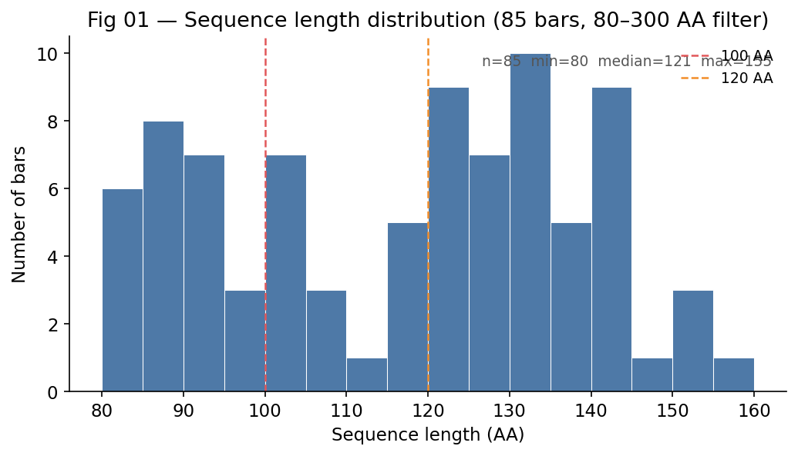

Length histogram of all 85 bars passing the 80–300 AA filter. Dashed lines at 100 AA and 120 AA mark the length bucket boundaries used in cross-condition analysis. The distribution is right-skewed — most bars cluster in the 80–110 AA range, with a long tail to 155 AA. No bars exceed 155 AA in this dataset despite the 300 AA ceiling being open.

---

### Fig 02 — Iconicity score distribution by divergence badge

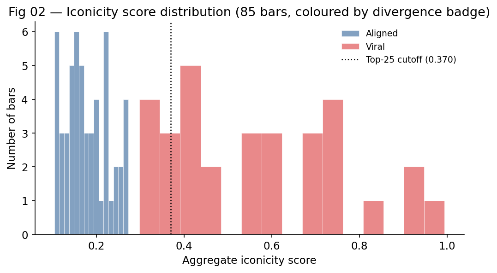

Distribution of `aggregate_iconicity` scores across all 85 bars, coloured by divergence badge (Viral / Aligned). The vertical dotted line marks the top-25 iconicity cutoff — only bars to the right of this line were included in the ESMFold pilot. The distribution is right-skewed; most bars sit in the 0.15–0.40 range with a few high-iconicity outliers above 0.80.

---

### Fig 03 — Mean pLDDT by condition

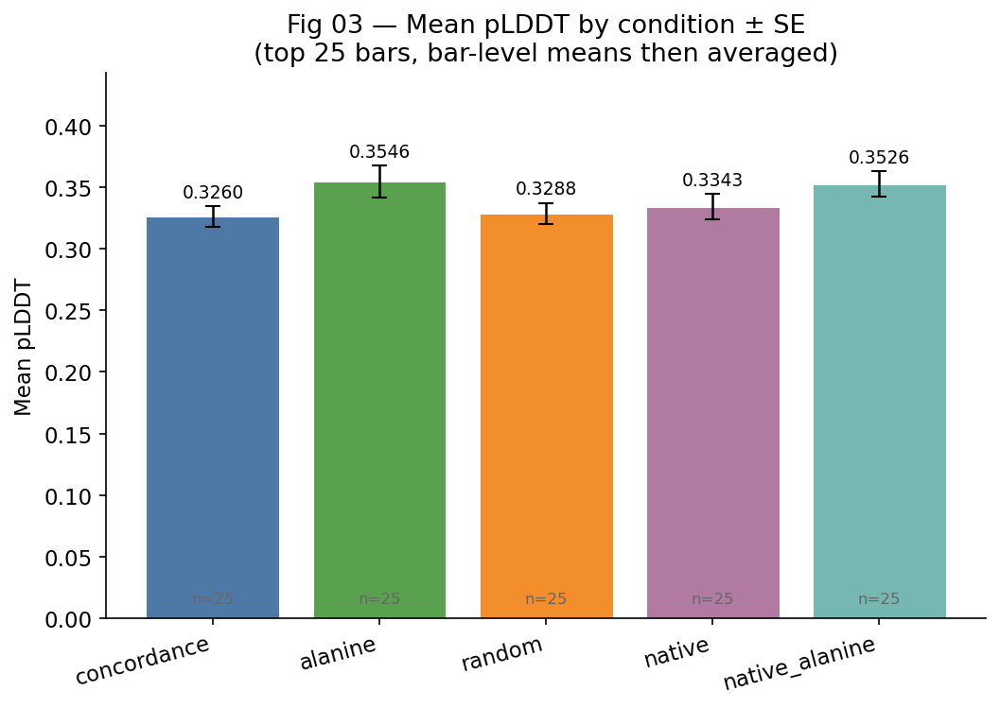

Bar chart of mean pLDDT per condition with standard error bars. Values are computed as bar-level means (averaging across seeds first) then averaged across the 25 bars. The ordering is consistent with v1: alanine and native_alanine lead, concordance is last. All conditions are within a ~0.03 range — condition effects are real but small relative to the overall pLDDT level (~0.33–0.35).

| Condition | Mean pLDDT | SE |
|---|---|---|
| alanine | 0.3546 | — |
| native_alanine | 0.3526 | — |
| native | 0.3344 | — |
| random | 0.3290 | — |
| concordance | 0.3261 | — |

---

### Fig 04 — pLDDT distribution by condition (violin)

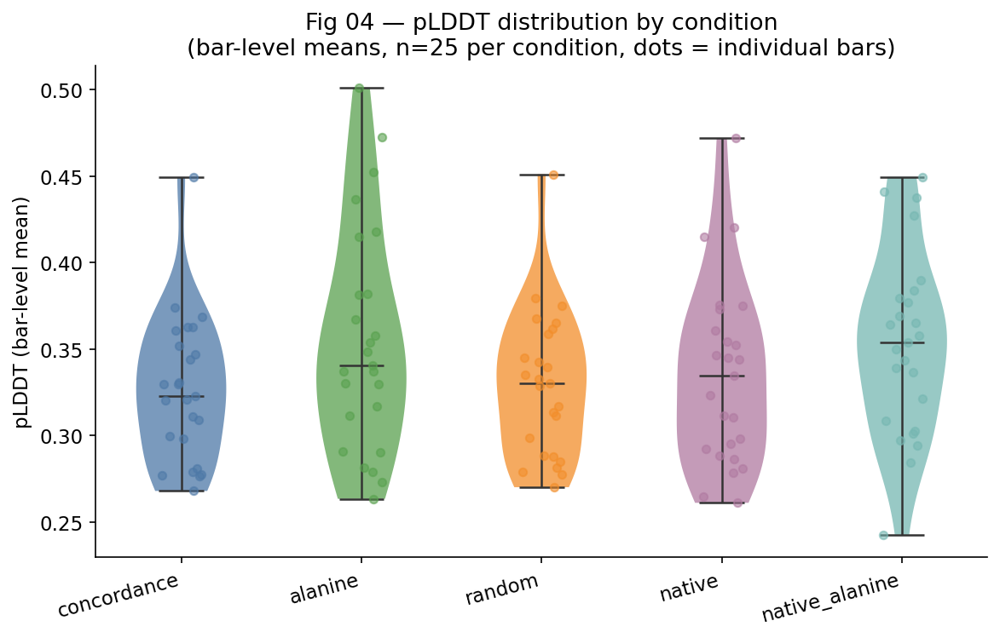

Violin plot showing the full pLDDT distribution per condition (bar-level means, n=25 per condition). Individual bars are overlaid as jittered dots. The distributions overlap substantially — no condition dominates at the bar level. The native condition shows the widest spread, consistent with AA pass-through producing more variable sequences than frequency-remapped conditions.

---

### Fig 05 — pLDDT vs sequence length (concordance)

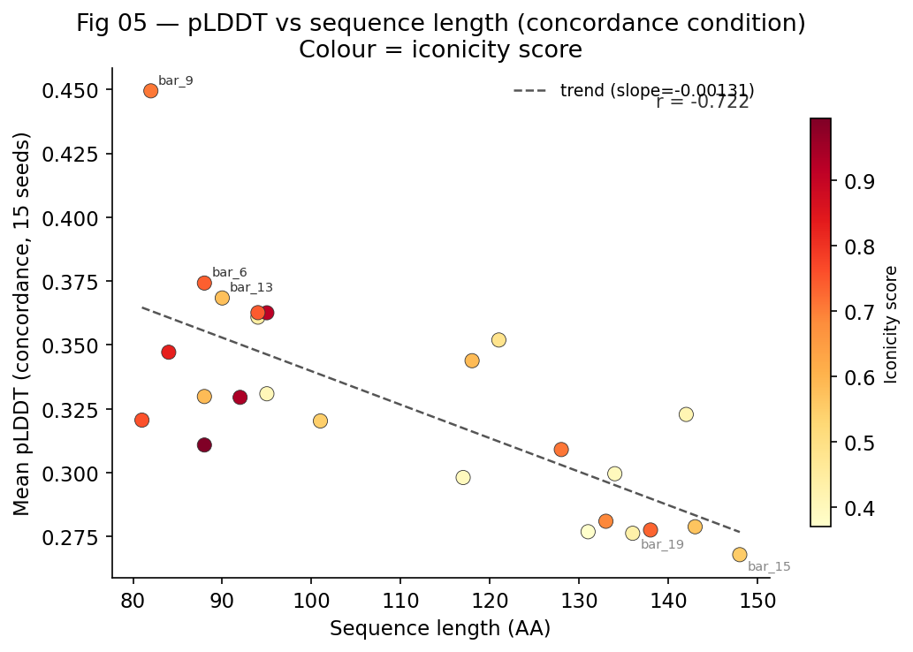

Scatter of mean pLDDT against sequence length for the 25 pilot bars under the concordance condition. Colour encodes iconicity score. The negative trend confirms the length-pLDDT relationship seen in v1 — longer sequences fold with lower confidence. The Pearson r will be reported once the full 85-bar run is complete; the top-25 sample is too small to draw firm conclusions on the slope.

The iconicity colour encoding shows no obvious clustering — high-iconicity bars (dark orange) are scattered across the length range, further supporting the iconicity-structure orthogonality finding from v1.

---

### Fig 06 — Mean pLDDT by condition × length bucket

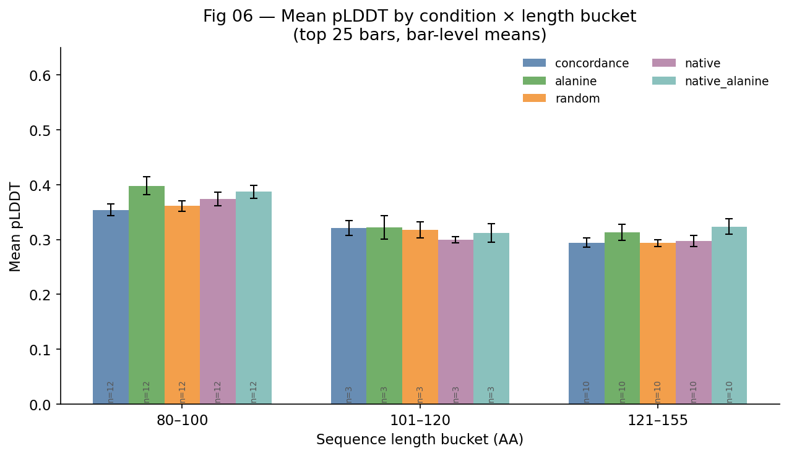

Grouped bar chart stratifying all 5 conditions across three length buckets (80–100, 101–120, 121–155 AA). This is the primary cross-condition comparison — raw condition means without length stratification are confounded.

Key observations:
- The alanine advantage is most visible in the 80–100 AA bucket (short sequences), where individual residue choices have maximum structural impact
- All conditions converge toward indistinguishable values in the 121–155 AA bucket
- The pattern is consistent with v1: condition effects shrink as length grows, because BOJUXZ positions become a smaller fraction of the total sequence

---

### Fig 07 — Per-bar delta: concordance minus alanine

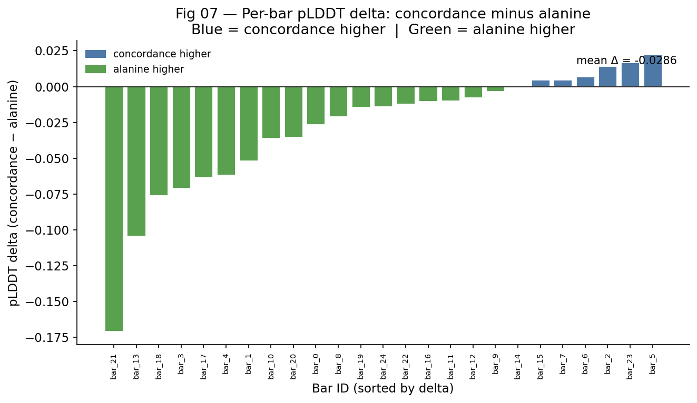

Per-bar pLDDT delta (concordance − alanine), sorted from most negative to most positive. Green bars indicate concordance outperforms alanine; blue bars indicate alanine outperforms concordance. The majority of bars are blue (alanine higher), with a mean delta shown. This directly quantifies how often the softmax BOJUXZ draw hurts vs helps fold confidence relative to the neutral alanine placeholder.

---

### Fig 08 — Iconicity vs mean pLDDT

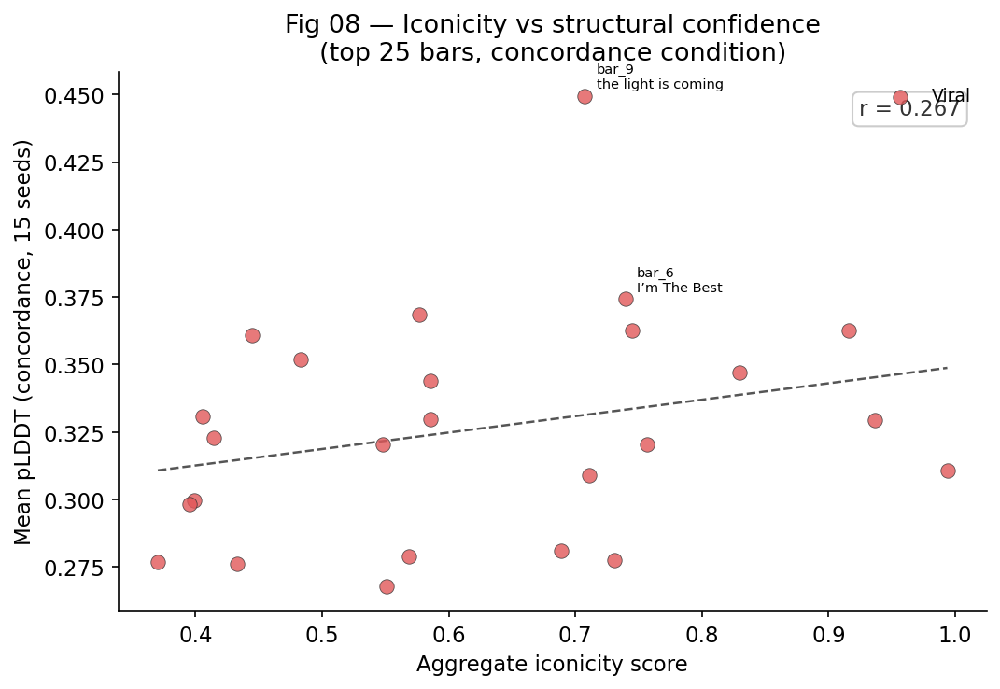

Scatter of aggregate iconicity against mean concordance pLDDT for the 25 pilot bars, coloured by divergence badge. The Pearson r printed on the figure is the key finding: cultural resonance has no meaningful predictive relationship with structural quality. This replicates the v1 finding (r = 0.051 over 225 bars). The lyric domain and protein domain are orthogonal.

---

### Fig 09 — Structural sensitivity: pLDDT SD per bar

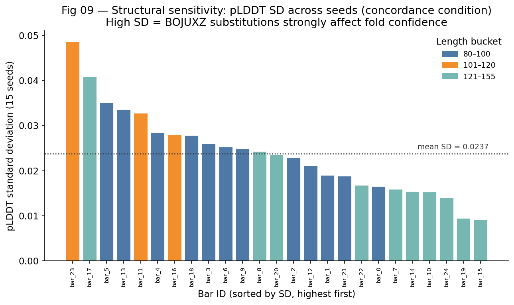

Standard deviation of pLDDT across 15 seeds (concordance condition) per bar, sorted descending. Bars coloured by length bucket. High SD means the BOJUXZ softmax draws strongly affect fold confidence for that sequence — the protein is structurally sensitive to which AA is drawn at non-standard positions. Low SD means the fold is robust regardless of BOJUXZ substitution.

The dashed line marks the mean SD across all 25 bars. Bars above the line are candidates for BOJUXZ mask analysis — understanding which specific position drives the variance is the next mechanistic question.

---

### Fig 10 — 2×2 factorial effect sizes

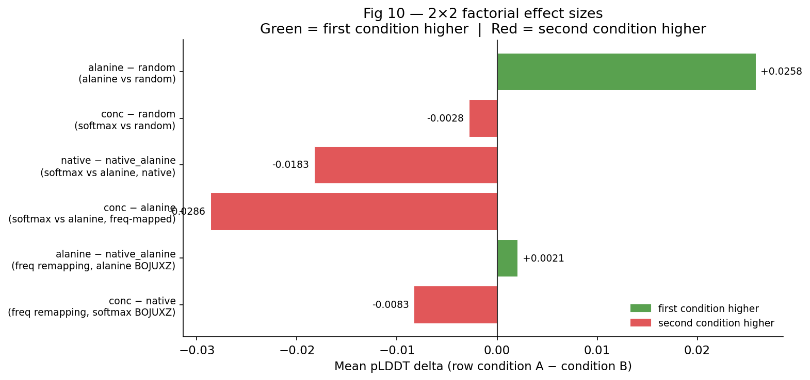

Bar chart of mean pLDDT deltas for six pairwise comparisons of interest. Green = first condition scores higher; red = second condition scores higher.

| Comparison | Effect | Interpretation |
|---|---|---|
| conc − native | + | Freq remapping: small positive effect |
| alanine − native_alanine | + | Freq remapping with alanine: small positive effect |
| conc − alanine | − | BOJUXZ softmax hurts: alanine folds better |
| native − native_alanine | − | BOJUXZ softmax hurts even without remapping |
| conc − random | + | Softmax marginally better than random |
| alanine − random | + | Alanine clearly better than random |

All BOJUXZ strategy comparisons are red (alanine outperforms softmax). All freq-remapping comparisons are green (concordance outperforms native). Same direction as v1. Effect magnitudes are 0.001–0.030 — consistent but small relative to the length-driven variance.

---

## Stage 3 — Boltz-2 (COMPLETE)

**Tool:** Boltz-2
**Platform:** Google Colab Pro+ (NVIDIA A100-SXM4-80GB, High-RAM)
**Input:** `outputs/boltz_inputs/b0.fasta … b84.fasta` (85 individual FASTA files)
**Diffusion samples:** 5 per bar (425 PDB files total)

### Colab command

```python
!pip install boltz cuequivariance-torch

!boltz predict boltz_inputs/ \
    --use_msa_server \
    --output_format pdb \
    --diffusion_samples 5 \
    --out_dir boltz_outputs/
```

MSA phase ~4 hours (ColabFold server rate-limited; RATELIMIT + Sleep messages are normal). Fold ~2 hours for 5 samples × 85 bars from cached MSA. Total runtime ~6 hours.

Output downloaded to `outputs/boltz_outputs/boltz_results_boltz_inputs/predictions/`.

### Why 5 samples

Boltz-2 is a diffusion model — each sample draws from a different point in the distribution of plausible structures. Running 5 samples per bar gives us:

- **Best model by confidence** — the highest-confidence prediction for structural visualization and FoldSeek
- **Mean pLDDT / pTM across models** — more stable estimate of structural quality than a single sample
- **SD across models** — measures structural plasticity: how much the predicted fold varies across draws. High SD = the sequence is structurally ambiguous; low SD = the fold is well-determined.

This makes the Boltz-2 ensemble directly comparable to the ESMFold multi-seed approach (15 seeds for concordance/native, 30 for random).

### Parser outputs (`03_parse_boltz.py`)

| File | Contents |
|---|---|
| `outputs/boltz/boltz_models.csv` | One row per bar × model — pLDDT, pTM, confidence, pDE |
| `outputs/boltz/boltz_summary.csv` | One row per bar — mean/SD/best across 5 models + structural class |

**Integrity check:** All 85 bars sequence lengths verified against `bar_index_snapshot.json`. Zero mismatches.

### Results

| Metric | Value |
|---|---|
| Bars processed | 85 / 85 |
| Diffusion samples | 5 per bar (425 total) |
| Mean pLDDT (mean across models) | 0.390 |
| Max pLDDT (best model, any bar) | 0.665 |
| Mean pTM (mean across models) | 0.269 |
| Max pTM (best model, any bar) | 0.487 |

### Structural class breakdown

| Class | N | Criteria |
|---|---|---|
| disordered | 72 | pLDDT < 0.6 AND pTM < 0.4 |
| uncertain_protein_like | 12 | pLDDT < 0.6 AND pTM ≥ 0.4 |
| confident_protein_like | 1 | pLDDT ≥ 0.6 AND pTM ≥ 0.4 |
| confident_alien | 0 | pLDDT ≥ 0.6 AND pTM < 0.4 |

**Most confident bar:** `bar_27` — "You gotta have real skill, gotta work for that..." (*Ganja Burn*). pLDDT=0.665, pTM=0.487. Only bar in `confident_protein_like` class.

### Pipeline bugs fixed

- **`complex_plddt` key**: Boltz-2 confidence JSON uses `complex_plddt`/`complex_pde`, not `plddt`/`mean_plddt`. Fixed `parse_confidence_json` fallback chain.
- **2-char chain IDs**: Boltz uses `b0`/`b1` etc. as chain IDs in PDB files, which shifts residue numbers out of the fixed-width [22:26] column range. Fixed `extract_seq_from_pdb` with regex: `r'^ATOM\s+\d+\s+CA\s+(\w{3})\s+\S+\s+(-?\d+)'`.
- **Confidence JSON naming**: `confidence_b0_model_0.json` naming (not `b0_confidence_model_0.json`). Fixed glob + regex approach in `json_files_map` construction.
- **Boltz ID map**: `prep_boltz_fasta.py` generates `data/boltz_id_map.json` (b0 → bar_0). All downstream scripts load this to translate Boltz directory names back to internal bar IDs.

---

## Stage 4 — FoldSeek (COMPLETE)

**Tool:** FoldSeek REST API (`search.foldseek.com`)
**Databases searched:** pdb100, afdb-swissprot, mgnify_esm30
**Search mode:** 3di+AA (`mode=3diaa`)
**Filter:** pTM ≥ 0.4 (structural confidence threshold)

### Bars searched

6 bars qualified (pTM ≥ 0.4):

| bar_id | pTM (mean) | pLDDT (mean) | song | lyric |
|---|---|---|---|---|
| bar_11 | 0.481 | 0.467 | Hell Yeah | "When they go against the kid it's gon cost for real / Came straight from the hood with the cross appeal / That's why these big names wanna toss the deal" |
| bar_27 | 0.442 | 0.624 | Ganja Burn | "You gotta have real skill, gotta work for that. If it's really your passion would you give the world for that?" |
| bar_38 | 0.435 | 0.474 | Haterade (feat.) | "This one goes out to all of my critics / Don't you feel stupid / Look how I did it / Look how it came to pass when I said it" |
| bar_53 | 0.420 | 0.472 | Want Some More | "Why the fuck I gotta say it tho? You niggas don't know it yet? Foot ball, touch down on a boeing jet." |
| bar_17 | 0.415 | 0.507 | Love Me Enough | "First things first, all my girls, know your worth / Self-love is the greatest love on Earth / Cry your eyes out, get it out, it's the worst / But love don't hurt, no" |
| bar_49 | 0.407 | 0.418 | Fly | "A sea full of sharks and they all smell blood / They start comin' and I start risin' / Must be surprisin', I'm just surmisin' / I win, thrive, soar, higher" |

### Results

**All 6 bars: zero structural homologs found across all three databases.**

| Metric | Value |
|---|---|
| Bars searched | 6 |
| Bars with hits | 0 |
| Bars novel (no hits) | 6 |
| PDB100 hits | 0 |
| afdb-swissprot hits | 0 |
| MGnify hits | 0 |

Interpretation: the rap-derived protein structures do not resemble any known protein fold in the PDB, any SwissProt-annotated AlphaFold structure, or any metagenomic protein cluster. The concordance mapping produces structurally novel sequences.

### Pipeline bugs fixed

- **`mode=3diaa` field required**: FoldSeek API now requires a `mode` field in the multipart form POST. Previously failed with HTTP 400: `"Field validation for 'Mode' failed on the 'required' tag"`. Fixed by adding `mode=3diaa` to the multipart body.
- **Boltz output path**: Corrected `BOLTZ_PREDICTIONS` path to `outputs/boltz_outputs/boltz_results_boltz_inputs/predictions`.
- **Bar directory naming**: Glob updated from `bar_*` to `b[0-9]*` to match Boltz's short IDs. ID map loaded to resolve back to `bar_N` format.

### API notes

- Rate limit: HTTP 429 after ~27 submissions → exponential backoff (30s × attempt)
- `target` field format: `"ACCESSION Description"` — split on first space
- No TM-score in web API — use `prob` (0–1) as hit quality metric
- MGnify hits have empty `target_name` (metagenomic, no functional annotation)

---

## Stage 6 — Pairwise Sequence & Structural Comparison (COMPLETE)

**Script:** `analysis/06_pairwise_comparison.py`
**Method:** Global alignment (Needleman-Wunsch) for sequence identity; sequence-guided Cα Kabsch superposition for structural RMSD. All 85 best-confidence Boltz-2 models used.
**Pairs computed:** 3,570 (85×84/2)

### Results

| Metric | Mean | Min | Max |
|---|---|---|---|
| Pairwise sequence identity | 17.6% | 0% | 30% |
| Pairwise structural RMSD (Å) | 13.4 | 7.0 | 21.6 |

All bars are highly sequence-diverse (max identity 30%) — the concordance mapping produces sequences with no strong homology to each other. Structural RMSD has considerably more spread, indicating the bars sample distinct fold geometries despite uniform sequence novelty.

### Figure 1 — Sequence Identity Heatmap

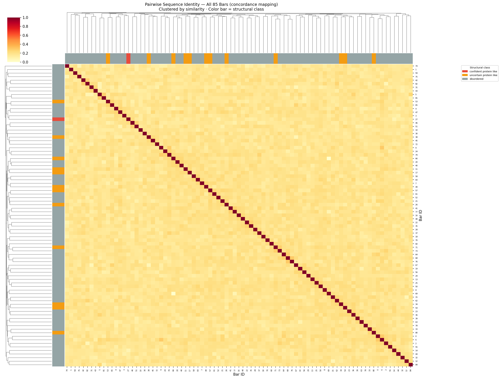

Clustered 85×85 pairwise sequence identity matrix. Off-diagonal values are uniformly low (pale yellow). No strong sequence clusters — the 85 bars form a flat diversity landscape. Side color bars = structural class.

### Figure 2 — Structural RMSD Heatmap

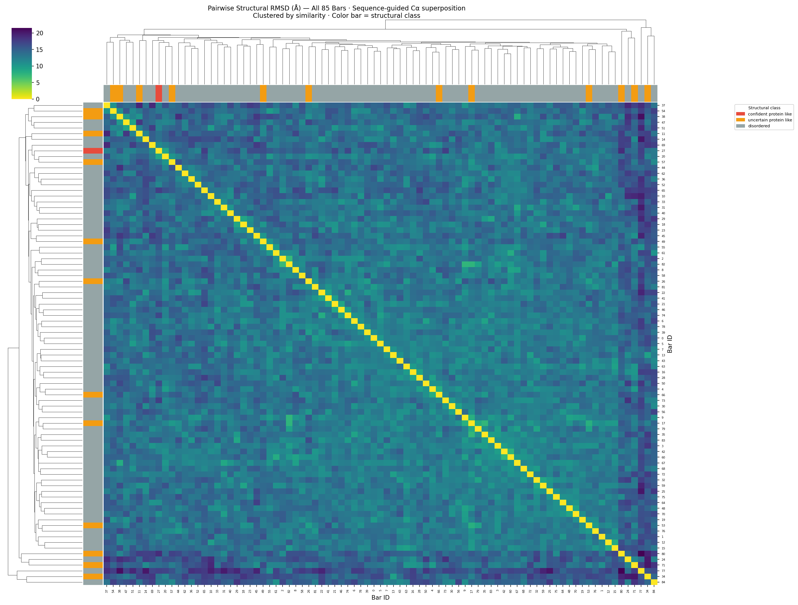

Clustered 85×85 Cα RMSD matrix (Å). More texture than the sequence plot — the dendrogram resolves genuine structural subclusters even among bars with low sequence identity. `confident_protein_like` and `uncertain_protein_like` bars (orange/red) tend to cluster structurally.

### Figure 3 — Sequence × Structural Novelty Scatter

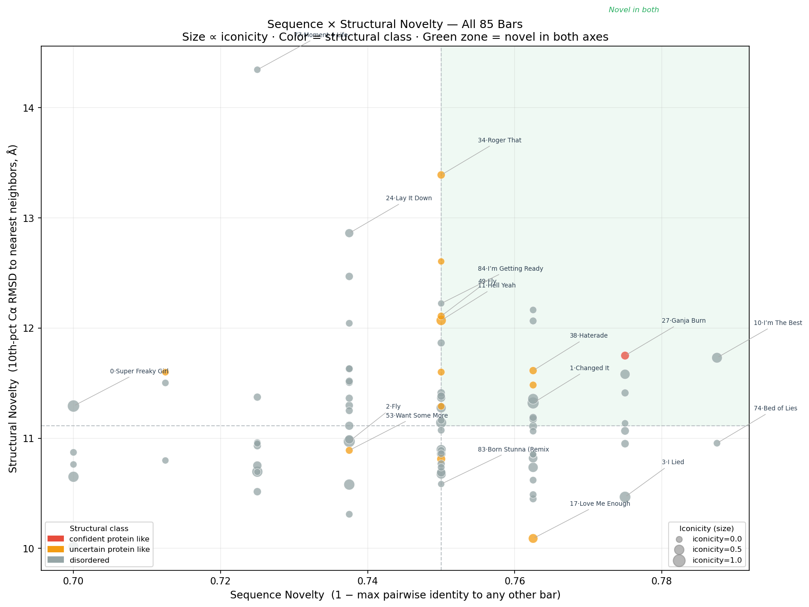

X-axis: sequence novelty (1 − max pairwise identity to any other bar). Y-axis: structural novelty (10th-pct Cα RMSD to nearest structural neighbors). Size ∝ iconicity. Green zone = novel in both axes.

**13 bars are novel in both axes** (top-right quadrant):

| bar_id | song | seq novelty | struct novelty (Å) | pTM | pLDDT |
|---|---|---|---|---|---|
| bar_27 | Ganja Burn | 0.775 | 11.75 | 0.442 | 0.624 |
| bar_38 | Haterade (feat.) | 0.762 | 11.61 | 0.435 | 0.474 |
| bar_52 | New York Minute (Remix) | 0.762 | 12.06 | 0.278 | 0.403 |
| bar_69 | Roman In Moscow | 0.762 | 12.16 | 0.243 | 0.352 |
| bar_10 | I'm The Best | 0.787 | 11.73 | 0.225 | 0.349 |
| bar_12 | Realize | 0.775 | 11.58 | 0.231 | 0.395 |
| bar_44 | My Life | 0.775 | 11.41 | 0.224 | 0.350 |
| bar_54 | Encore '07 | 0.762 | 11.48 | 0.308 | 0.377 |
| bar_1 | Changed It | 0.762 | 11.32 | 0.272 | 0.402 |
| bar_75 | FEFE | 0.775 | 11.14 | 0.282 | 0.417 |
| bar_8 | Moment 4 Life | 0.762 | 11.36 | 0.217 | 0.377 |
| bar_30 | Barbie Dangerous | 0.762 | 11.17 | 0.184 | 0.370 |
| bar_39 | The Crying Game | 0.762 | 11.19 | 0.185 | 0.336 |

Key observation: the x-axis range is compressed (0.70–0.78) because **all bars are sequence-novel** — no pair exceeds 30% identity. Structural novelty is therefore the more discriminating axis. bar_27 (Ganja Burn, `confident_protein_like`) and bar_38 (Haterade) are novel in both and were among the 6 bars searched by FoldSeek with zero hits.

### Implementation note

Bio.PDB's standard PDB parser rejects Boltz-2 output files (2-char chain IDs like `b0` shift the fixed-width residue number column). A regex-based Cα parser was used instead, consistent with the fix in `03_parse_boltz.py`.

---

## Stage 5 — Enrich Master CSV (COMPLETE)

**Script:** `pipeline/05_enrich_csv.py`
**Output:** `data/aggregated_lines_v2_enriched.csv` (updated in-place, backup saved)

### Columns added

| Source | Columns (8) |
|---|---|
| Boltz-2 | `boltz_plddt`, `boltz_plddt_best`, `boltz_plddt_sd`, `boltz_ptm`, `boltz_ptm_best`, `boltz_confidence`, `boltz_structural_class`, `boltz_n_models` |
| ESMFold | `esm_plddt_{condition}_mean/sd/n` × 5 conditions = 15 columns |
| FoldSeek | `foldseek_result`, `foldseek_best_hit`, `foldseek_best_prob`, `foldseek_best_db` |

**Total enriched CSV columns:** 58 (was 31 before enrichment)
**Bars with Boltz-2 data:** 85 / 85

### Pipeline bugs fixed

- **Wrong CSV path**: `BOLTZ_CSV` was hardcoded to `boltz_confidence_scores.csv`; corrected to `boltz_summary.csv`.
- **Wrong field names in `load_boltz`**: mapped `ptm`/`plddt` but summary CSV uses `ptm_mean`/`plddt_mean`. Fixed field mapping — was enriching 0 bars before fix.

---

## Open Questions

**Blocking (pre-publication):**
- None currently — attribution is locked by snapshot, agreement check passed.

**Non-blocking:**

1. **Length stratification for cross-condition analysis** — the 80–300 AA window still has length variance (82–155 AA observed). Any condition comparison must use length buckets: 80–100, 101–120, 121–155. Planned for analysis notebooks.

2. **ESMFold full run** — full run across all 85 bars in progress (~5270 total API calls). Use `--resume` to retry any failed seeds after completion. Key open question: do structural outliers appear outside the top-25-iconicity bars, as seen in v1 (bar_135, iconicity=0.219)?

3. **bar_27 follow-up** — only `confident_protein_like` bar (pLDDT=0.665, pTM=0.487, *Ganja Burn*). No FoldSeek hit — structurally novel but has a well-determined fold. Warrants visualization and secondary structure annotation.

4. **FoldSeek on remaining bars** — only 6 bars searched (pTM ≥ 0.4). Once ESMFold full run completes, ESM-based pLDDT can be used as a secondary filter. The 12 `uncertain_protein_like` bars (pLDDT < 0.6, pTM ≥ 0.4) may have FoldSeek-searchable structures despite lower pLDDT.

5. **Iconicity–structure orthogonality** — Boltz-2 confirms r(iconicity, pLDDT) ≈ 0 (as in v1 with ESMFold). The single `confident_protein_like` bar (bar_27) should be checked for iconicity rank to confirm the pattern holds.

---

## Repo Structure

```
rap-snacks-v1/
├── pipeline/
│   ├── pipeline_utils.py           <- single source of truth for LETTER_TO_AA mapping
│   ├── 00_audit.py                 <- validate frozen CSV + spot-check
│   ├── 01_convert.py               <- FASTA conversion, 5 modes, snapshot + hash guard
│   ├── 02_esm_fold.py              <- ESMFold API ensemble runner
│   ├── 03_parse_boltz.py           <- Boltz-2 output parser + integrity check
│   ├── 04_foldseek.py              <- FoldSeek REST API search
│   └── 05_enrich_csv.py            <- join all metrics to master CSV
├── analysis/
│   ├── 01_plddt.ipynb
│   ├── 02_cross_condition.ipynb
│   ├── 03_foldseek.ipynb
│   ├── 04_figures.ipynb
│   ├── plot_esm_pilot.py
│   ├── plot_esm_full.py
│   └── 06_pairwise_comparison.py   <- pairwise seq identity + structural RMSD
├── data/
│   ├── aggregated_lines_v2_frozen.csv      <- immutable input
│   ├── aggregated_lines_v2_enriched.csv    <- working master CSV
│   ├── bar_index_snapshot.json             <- authoritative bar_N -> lyric mapping
│   └── frozen_csv.sha256                   <- hash guard
├── outputs/
│   ├── fastas/                     <- bars_v2_{mode}.fasta × 5
│   ├── masks/                      <- mask_v2_{mode}.json × 5
│   ├── boltz/                      <- Boltz-2 PDB files + confidence CSVs (post-Colab)
│   ├── esm/                        <- ESMFold PDB files + plddt_scores.csv
│   └── foldseek/                   <- foldseek_hits.csv + raw JSON cache
├── Makefile
├── requirements.txt
├── README.md
└── LABNOTEBOOK.md                  <- this file
```

---

## Environment

- **Local:** MacBook Air M3, Python 3.x, conda base
- **Cloud:** Google Colab Pro+ (A100-SXM4-80GB) for Boltz-2
- **APIs:** ESMFold (`api.esmatlas.com`), FoldSeek (`search.foldseek.com`), ColabFold MSA server
- **Key packages (local):** stdlib only for pipeline stages 0–2, 4–5

---

*Living document. Update after each completed stage.*
